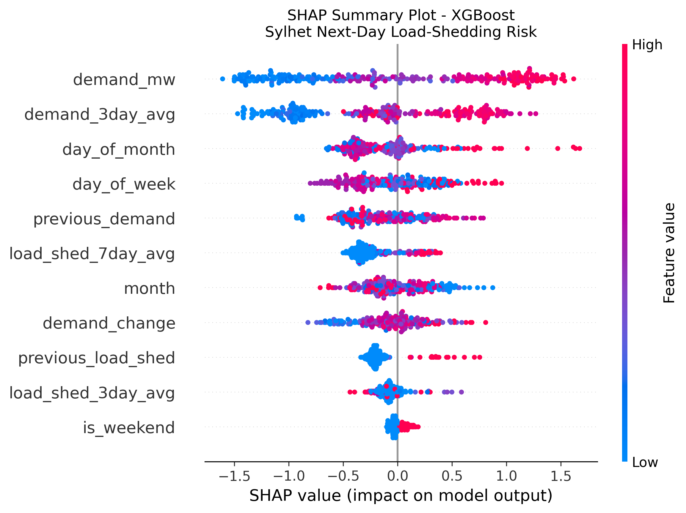

# PowerGuard BD

**Explainable AI for next-day load-shedding risk prediction and risk-aware backup energy management — Sylhet, Bangladesh (BPDB data, 2023–2025).**

PowerGuard BD is a research prototype that chains **data collection → feature engineering → XGBoost classification → SHAP explanations → priority-based load optimization**, with an interactive **Streamlit dashboard** that ties predictions to device recommendations.

| Component | Status |
| --- | --- |
| BPDB scraping & merged datasets | Complete |
| Sylhet feature engineering (3-year) | Complete |
| Model comparison (LR, RF, XGBoost) | Complete |
| Threshold tuning | Complete |
| SHAP analysis & exports | Complete |
| Standalone energy optimizer (`energy_optimizer.py`) | Complete |
| Risk-aware optimizer v2 (`optimization/energy_optimizer_v2.py`) | Complete |
| ML → optimizer CLI (`optimization/powerguard_system.py`) | Complete |
| Streamlit dashboard (`optimization/app.py`) | Complete |
| Django backend & ESP32 hardware demo | Planned |

---

## Table of contents

- [Overview](#overview)
- [Repository structure](#repository-structure)
- [Workflow](#workflow)
- [Data & features](#data--features)
- [Machine learning](#machine-learning)
- [Explainable AI (SHAP)](#explainable-ai-shap)
- [Energy management & dashboard](#energy-management--dashboard)
- [Getting started](#getting-started)
- [Roadmap](#roadmap)
- [Technology stack](#technology-stack)
- [Scope & disclaimer](#scope--disclaimer)
- [Author](#author)

---

## Overview

Electricity load shedding affects homes, schools, clinics, and any environment that depends on continuous power. PowerGuard BD supports **preparedness** in two linked steps:

1. **Predict** whether Sylhet is likely to experience load shedding on the **next day** (binary risk from historical BPDB area-wise records).
2. **Explain** the prediction with SHAP, then **optimize** which demo loads to keep on a limited battery when risk is high, medium, or low.

```text
                    ┌──────────────────────────────────────┐
                    │  BPDB area-wise demand / load shed   │
                    └──────────────────┬───────────────────┘
                                       ▼
                    ┌──────────────────────────────────────┐
                    │  merge_data → prepare_3year_dataset  │
                    └──────────────────┬───────────────────┘
                                       ▼
                    ┌──────────────────────────────────────┐
                    │  train_3year_models / threshold_tune │
                    │  → xgboost_2025_predictions.csv      │
                    └──────────────────┬───────────────────┘
                                       ▼
              ┌────────────────────────┴────────────────────────┐
              ▼                                                 ▼
   ┌─────────────────────┐                         ┌─────────────────────┐
   │  shap_analysis.py   │                         │  optimization/      │
   │  → shap_results/    │                         │  app.py (Streamlit) │
   └─────────────────────┘                         │  powerguard_system  │
                                                     └──────────┬──────────┘
                                                                ▼
                                                     Risk-aware device ON/OFF plan
```

**Target variable (`next_day_risk`)**

| Value | Meaning |
| ---: | --- |
| `0` | No load shedding on the following day |
| `1` | Load shedding on the following day |

---

## Repository structure

```text
PowerGrid_BD/
│
├── Data collection & preparation
│   ├── collect_bpdb.py                 # Scrape BPDB area-wise pages (configurable year)
│   ├── merge_data.py                   # Merge 2023–2025 yearly CSVs
│   ├── check_data.py                   # Validation helpers
│   ├── eda_bpdb.py                     # Zone-level EDA plots
│   ├── prepare_dataset.py              # Earlier single-year Sylhet pipeline
│   └── prepare_3year_dataset.py        # Builds primary modeling CSV
│
├── Modeling & evaluation
│   ├── train_models.py                 # Initial training workflow
│   ├── train_3year_models.py           # LR / RF / XGBoost on 2023–24 train, 2025 test
│   └── threshold_tuning.py             # XGBoost probability threshold search
│
├── Explainability
│   └── shap_analysis.py                # TreeExplainer, plots, CSV exports
│
├── Legacy optimizer (root)
│   └── energy_optimizer.py             # Priority score, fixed demo scenario (no ML link)
│
├── optimization/                       # Integrated risk → energy management
│   ├── app.py                          # Streamlit UI: predict, optimize, SHAP panel
│   ├── powerguard_system.py            # Interactive CLI: date + battery + duration
│   ├── energy_optimizer_v2.py            # Risk-aware combinatorial optimizer (standalone demo)
│   └── powerguard_system_backup.py     # Backup copy of integrated CLI logic
│
├── Raw & engineered data (CSV)
│   ├── bpdb_area_wise_2023.csv
│   ├── bpdb_area_wise_2024.csv
│   ├── bpdb_area_wise_2025.csv
│   ├── bpdb_area_wise_2023_2025.csv
│   ├── sylhet_prediction_dataset.csv
│   └── sylhet_2023_2025_prediction_dataset.csv   # Primary modeling file (938 rows)
│
├── Model outputs
│   ├── model_comparison_2023_2025.csv
│   └── xgboost_2025_predictions.csv              # Dates, probs, labels for dashboard/CLI
│
├── shap_results/
│   ├── shap_feature_importance.csv
│   ├── shap_values_2025.csv
│   ├── shap_beeswarm.png                 # Script-generated beeswarm (2025 test set)
│   ├── image.png                         # Dashboard: inputs & analyze control
│   ├── img2.png                          # Dashboard: global SHAP feature table
│   └── img3.png                          # Dashboard: bar + beeswarm SHAP views
│
├── README.md
└── .gitattributes
```

Scratch or local-only files (`Test.py`, `tempCodeRunnerFile.py`, `optimization/tempCodeRunnerFile.py`) are not part of the documented pipeline.

> **Note:** `shap_analysis.py` can also write `shap_feature_importance_bar.png` and `shap_highest_risk_waterfall.png` when run; the Streamlit app references those paths. The README figures below use the assets currently in `shap_results/`, including your dashboard screenshots.

---

## Workflow

| Step | Script | Main output |
| ---: | --- | --- |
| 1 | `collect_bpdb.py` | `bpdb_area_wise_<year>.csv` |
| 2 | `merge_data.py` | `bpdb_area_wise_2023_2025.csv` |
| 3 | `prepare_3year_dataset.py` | `sylhet_2023_2025_prediction_dataset.csv` |
| 4 | `train_3year_models.py` | `model_comparison_2023_2025.csv` |
| 5 | `threshold_tuning.py` | Console metrics; tuned decision threshold |
| 6 | `shap_analysis.py` | `shap_results/*.csv` and optional PNG plots |
| 7 | `optimization/powerguard_system.py` **or** `optimization/app.py` | Risk level + recommended loads |

Optional: `eda_bpdb.py`, `check_data.py`, `energy_optimizer.py` (baseline optimizer without XGBoost input).

---

## Data & features

- **Source:** [BPDB area-wise demand](https://misc.bpdb.gov.bd/area-wise-demand) publications (scraped via `collect_bpdb.py`).
- **Region:** Sylhet (`zone == "Sylhet"`).
- **Horizon:** 2023–2025 daily records.
- **Modeling file:** `sylhet_2023_2025_prediction_dataset.csv` — **938** rows after engineering.
- **Split:** Train **2023–2024** (670 rows); test **2025** (268 rows). The 2025 test set is imbalanced (**253** negative vs **15** positive days).

**Features (11 → `next_day_risk`):**

`demand_mw`, `previous_load_shed`, `load_shed_3day_avg`, `load_shed_7day_avg`, `previous_demand`, `demand_3day_avg`, `demand_change`, `day_of_week`, `month`, `day_of_month`, `is_weekend`

---

## Machine learning

Models are trained in `train_3year_models.py` with a default classification threshold of **0.5** on 2025 holdout probabilities.

| Model | Accuracy | Precision | Recall | F1 | ROC-AUC | PR-AUC |
| --- | ---: | ---: | ---: | ---: | ---: | ---: |
| Logistic Regression | 0.560 | 0.101 | 0.867 | 0.181 | 0.778 | 0.139 |
| Random Forest | 0.642 | 0.107 | 0.733 | 0.186 | 0.761 | 0.155 |
| **XGBoost** | **0.825** | 0.119 | 0.333 | 0.175 | 0.735 | **0.253** |

**Primary model — XGBoost**

- `n_estimators=300`, `max_depth=4`, `learning_rate=0.05`, `subsample=0.8`, `colsample_bytree=0.8`
- Predictions for dashboard/CLI: `xgboost_2025_predictions.csv` (`predicted_probability`, `predicted_risk`, `next_day_risk`, etc.)

Use **ROC-AUC**, **PR-AUC**, recall, and `threshold_tuning.py` alongside accuracy because of class imbalance.

---

## Explainable AI (SHAP)

[`shap_analysis.py`](shap_analysis.py) retrains the same XGBoost setup on 2023–2024 and computes SHAP values for **every 2025 test day** using `shap.TreeExplainer`.

SHAP shows **how the model used each feature** for a prediction. It does **not** by itself prove causal relationships in the grid.

### Global importance (mean |SHAP| on 2025 test set)

| Rank | Feature | Mean \|SHAP\| |
| ---: | --- | ---: |
| 1 | `demand_mw` | 0.859 |
| 2 | `demand_3day_avg` | 0.641 |
| 3 | `day_of_month` | 0.307 |
| 4 | `day_of_week` | 0.304 |
| 5 | `previous_demand` | 0.296 |
| 6 | `load_shed_7day_avg` | 0.287 |
| 7 | `month` | 0.230 |
| 8 | `demand_change` | 0.222 |
| 9 | `previous_load_shed` | 0.220 |
| 10 | `load_shed_3day_avg` | 0.103 |
| 11 | `is_weekend` | 0.049 |

**Interpretation:** Current and smoothed **demand** dominate; calendar and recent load-shed history add secondary signal. High demand (red in beeswarm plots) tends to push risk upward.

### Artifacts

| File | Description |
| --- | --- |
| `shap_results/shap_feature_importance.csv` | Sorted global importance |
| `shap_results/shap_values_2025.csv` | Per-day SHAP contributions + probabilities + labels |

Regenerate after data or model changes:

```bash
python shap_analysis.py
```

### Visualizations

**Standalone SHAP beeswarm** (matplotlib export from `shap_analysis.py` — feature value vs. impact on model output):



**Streamlit dashboard — energy inputs and analysis entry point:**


**Streamlit — Explainable AI panel with global SHAP table:**


**Streamlit — combined SHAP bar and beeswarm views:**


Example high-risk case from analysis: **2025-10-15**, predicted probability **≈ 0.946**, actual next-day risk **1** (waterfall plot available after running `shap_analysis.py`).

---

## Energy management & dashboard

### Risk levels (used in `optimization/`)

| Level | Condition (`predicted_probability`) | Load policy (summary) |
| --- | --- | --- |
| **HIGH** | ≥ 0.80 | Essential (priority 1) only — e.g. router, LED |
| **MEDIUM** | ≥ 0.50 | Priority 1 and 2; exclude priority 3 |
| **LOW** | &lt; 0.50 | Maximize priority score within battery budget |

### Demo device catalog

| Device | Power (W) | Priority |
| --- | ---: | ---: |
| Router | 8 | 1 |
| LED Light | 10 | 1 |
| Fan | 25 | 2 |
| Laptop | 45 | 2 |
| Extra Light | 10 | 3 |

Optimization is a **combinatorial search** over ON/OFF states subject to  
`total_power × outage_hours ≤ battery_capacity_wh`.

### Modules

| File | Role |
| --- | --- |
| [`energy_optimizer.py`](energy_optimizer.py) | Original prototype: fixed scenario, priority score only |
| [`optimization/energy_optimizer_v2.py`](optimization/energy_optimizer_v2.py) | Risk-aware scoring (standalone numeric demo) |
| [`optimization/powerguard_system.py`](optimization/powerguard_system.py) | CLI: pick date from `xgboost_2025_predictions.csv`, enter battery & duration, print plan |
| [`optimization/app.py`](optimization/app.py) | **Streamlit** dashboard: metrics, load table, SHAP section |

### Run the dashboard

```bash
pip install streamlit pandas
streamlit run optimization/app.py
```

Set **Prediction Date**, **Battery Capacity (Wh)**, and **Expected Outage Duration**, then **Analyze & Optimize**. The app loads predictions from `xgboost_2025_predictions.csv` and SHAP tables/images from `shap_results/`.

---

## Getting started

### Requirements

Python **3.10+** recommended.

```bash
pip install pandas numpy scikit-learn xgboost shap matplotlib requests beautifulsoup4 streamlit
```

### Reproduce core results (CSVs already in repo)

```bash
python train_3year_models.py
python shap_analysis.py
streamlit run optimization/app.py
```

### Paths

Many scripts use absolute paths (`D:\PowerGrid_BD\...`). Clone to that path or update path constants at the top of:

- `shap_analysis.py`
- `optimization/app.py`
- `optimization/powerguard_system.py`
- `merge_data.py`, `prepare_3year_dataset.py`, etc.

---

## Roadmap

### Phase 1 — Data & AI ✅

- [x] BPDB collection and multi-year merge
- [x] Sylhet feature engineering
- [x] Model comparison and XGBoost selection
- [x] SHAP exports and visualizations

### Phase 2 — Intelligent energy management 🚧

- [x] Baseline and risk-aware optimizers
- [x] CLI and Streamlit integration with XGBoost outputs
- [ ] Live retraining pipeline (not only 2025 CSV)
- [ ] User-defined device lists and priorities in UI
- [ ] Outage duration estimated from ML / historical stats

### Phase 3 — Platform & hardware ⏳

- [ ] Django REST API (optional migration from Streamlit)
- [ ] ESP32 + INA219 + relay demo (low-voltage DC loads only)
- [ ] End-to-end field-style demonstration

---

## Technology stack

| Area | Tools |
| --- | --- |
| Language | Python |
| ML | scikit-learn, XGBoost |
| XAI | SHAP |
| Data | pandas, NumPy |
| Visualization | matplotlib, SHAP plots |
| Web UI | Streamlit |
| Data collection | requests, BeautifulSoup |
| Planned | Django, ESP32, INA219 |

---

## Scope & disclaimer

- Predictions are **Sylhet area-level next-day risk**, not exact household outage times.
- Outputs are **research prototypes**, not operational guidance for BPDB or the national grid.
- Hardware plans target **safe low-voltage demonstration**, not direct 220 V AC switching.
- SHAP explains the **model**; feature effects are not guaranteed causal facts.

**Vision:** *Predict the risk. Explain the reason. Protect the essential loads.*

---

## Author

**Kushal Panthadas**  
North East University  
Department of Computer Science & Engineering, Bangladesh
