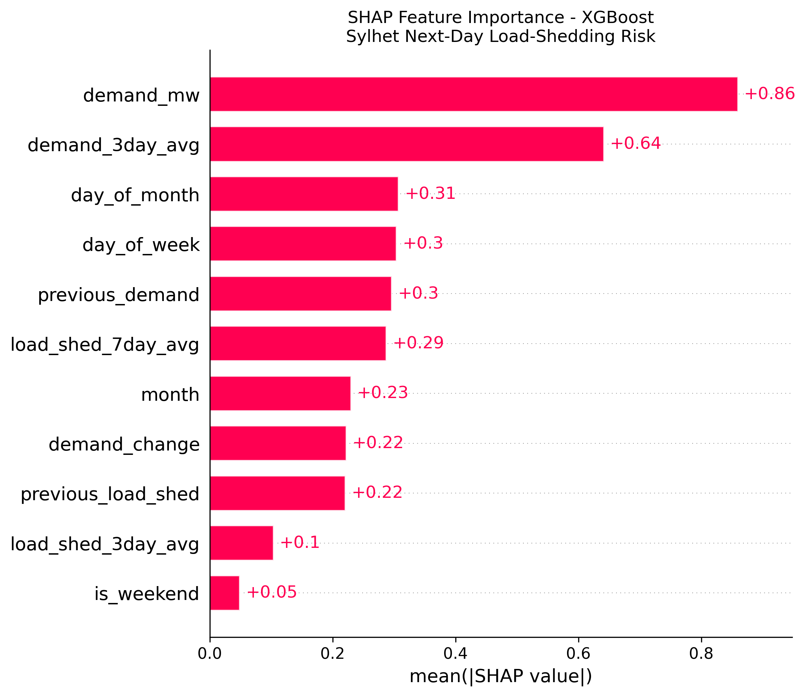
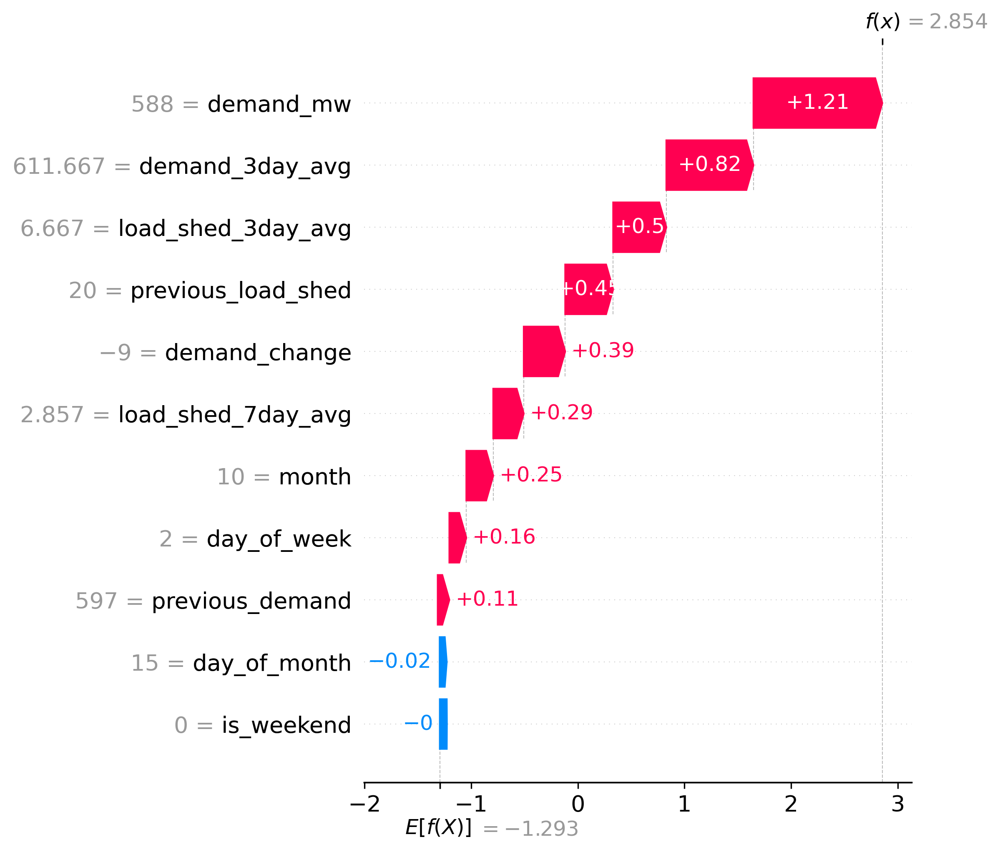

# PowerGuard BD

**An explainable AI system for next-day load-shedding risk prediction and intelligent backup-energy management in Bangladesh.**

PowerGuard BD combines machine learning, SHAP-based explainability, a priority-based energy optimizer, and (planned) ESP32 hardware into one research prototype. The current implementation focuses on **Sylhet** using **BPDB area-wise demand and load-shedding records (2023–2025)**.

| Stage | Status |
| --- | --- |
| Data collection & feature engineering | Complete |
| Model training & comparison | Complete |
| SHAP explainability | Complete |
| Energy optimizer (prototype) | Complete |
| Prediction → optimizer integration | In progress |
| Django backend, dashboard, ESP32 demo | Planned |

---

## Table of contents

- [Problem & approach](#problem--approach)
- [Repository layout](#repository-layout)
- [End-to-end pipeline](#end-to-end-pipeline)
- [Data](#data)
- [Machine learning](#machine-learning)
- [Explainable AI (SHAP)](#explainable-ai-shap)
- [Energy management optimizer](#energy-management-optimizer)
- [Getting started](#getting-started)
- [Roadmap](#roadmap)
- [Technology stack](#technology-stack)
- [Scope & disclaimer](#scope--disclaimer)
- [Author](#author)

---

## Problem & approach

Load shedding disrupts households, schools, small businesses, and infrastructure that depends on stable power. PowerGuard BD addresses preparedness in stages:

```text
BPDB area-wise electricity data
            │
            ▼
   Merge, clean, feature engineering (Sylhet)
            │
            ▼
   Classifiers (Logistic Regression, RF, XGBoost)
            │
            ▼
   Next-day load-shedding risk (binary)
            │
            ▼
   SHAP — why is risk high or low?
            │
            ▼
   Energy optimizer — which loads to keep on backup?
            │
            ▼
   (Planned) Django API, dashboard, ESP32 load control
```

**Prediction target**

| Label | Meaning |
| --- | --- |
| `0` | No load shedding on the following day |
| `1` | Load shedding on the following day |

---

## Repository layout

The project uses a **flat layout**: Python scripts, CSV datasets, and outputs live at the repository root (no nested `data/` or `models/` packages yet).

```text
PowerGrid_BD/
│
├── collect_bpdb.py              # Scrape BPDB area-wise demand pages (by year)
├── merge_data.py                # Merge yearly BPDB CSVs into one file
├── check_data.py                # Data quality checks
├── eda_bpdb.py                  # Exploratory plots (zone-level summaries)
│
├── prepare_dataset.py           # Early Sylhet feature set (2024-focused workflow)
├── prepare_3year_dataset.py     # Full 2023–2025 Sylhet prediction dataset
│
├── train_models.py              # Initial model training workflow
├── train_3year_models.py        # Train LR / RF / XGBoost; save comparison CSV
├── threshold_tuning.py          # Decision-threshold search for XGBoost
│
├── shap_analysis.py             # SHAP values, plots, and CSV exports
├── energy_optimizer.py          # Backup load selection under power budget
│
├── bpdb_area_wise_2023.csv      # Raw BPDB extract (2023)
├── bpdb_area_wise_2024.csv      # Raw BPDB extract (2024)
├── bpdb_area_wise_2025.csv      # Raw BPDB extract (2025)
├── bpdb_area_wise_2023_2025.csv # Merged multi-year raw data
│
├── sylhet_prediction_dataset.csv           # Engineered Sylhet features (legacy path)
├── sylhet_2023_2025_prediction_dataset.csv # Primary modeling dataset
│
├── model_comparison_2023_2025.csv # Test-set metrics (2025 holdout)
├── xgboost_2025_predictions.csv   # XGBoost outputs for 2025 test days
│
├── shap_results/                  # SHAP artifacts (generated by shap_analysis.py)
│   ├── shap_feature_importance.csv
│   ├── shap_values_2025.csv
│   ├── shap_feature_importance_bar.png
│   ├── shap_beeswarm.png
│   └── shap_highest_risk_waterfall.png
│
├── README.md
└── .gitattributes
```

Utility or scratch files (`Test.py`, `tempCodeRunnerFile.py`) are not part of the documented pipeline.

---

## End-to-end pipeline

Run scripts in roughly this order (adjust file paths inside each script if your clone is not on `D:\PowerGrid_BD`):

| Step | Script | Output |
| --- | --- | --- |
| 1 | `collect_bpdb.py` | `bpdb_area_wise_<year>.csv` |
| 2 | `merge_data.py` | `bpdb_area_wise_2023_2025.csv` |
| 3 | `prepare_3year_dataset.py` | `sylhet_2023_2025_prediction_dataset.csv` |
| 4 | `train_3year_models.py` | `model_comparison_2023_2025.csv` |
| 5 | `threshold_tuning.py` | Console metrics; tuned threshold for deployment |
| 6 | `shap_analysis.py` | `shap_results/` CSVs and PNG figures |
| 7 | `energy_optimizer.py` | Console: optimal device subset for demo scenario |

Optional: `eda_bpdb.py` and `check_data.py` for exploration and validation.

---

## Data

- **Source:** [Bangladesh Power Development Board (BPDB)](https://misc.bpdb.gov.bd/area-wise-demand) area-wise demand and load-shedding publications.
- **Geography:** Sylhet zone (filtered from national area-wise tables).
- **Period:** 2023–2025 (938 daily rows in the engineered dataset after processing).
- **Split:** Train on 2023–2024 (670 rows); evaluate on 2025 (268 rows).

**Model features** (11 inputs → `next_day_risk`):

`demand_mw`, `previous_load_shed`, `load_shed_3day_avg`, `load_shed_7day_avg`, `previous_demand`, `demand_3day_avg`, `demand_change`, `day_of_week`, `month`, `day_of_month`, `is_weekend`

---

## Machine learning

Three classifiers are compared on the **2025 holdout** with a default probability threshold of 0.5 (`train_3year_models.py`).

| Model | Accuracy | Precision | Recall | F1 | ROC-AUC | PR-AUC |
| --- | ---: | ---: | ---: | ---: | ---: | ---: |
| Logistic Regression | 0.560 | 0.101 | 0.867 | 0.181 | 0.778 | 0.139 |
| Random Forest | 0.642 | 0.107 | 0.733 | 0.186 | 0.761 | 0.155 |
| **XGBoost** | **0.825** | 0.119 | 0.333 | 0.175 | 0.735 | **0.253** |

**XGBoost** is the primary model (300 trees, `max_depth=4`, `learning_rate=0.05`). The test set is imbalanced (253 negative vs. 15 positive days in 2025), so accuracy alone is misleading; ROC-AUC, PR-AUC, recall, and threshold tuning (`threshold_tuning.py`) matter for operational use.

---

## Explainable AI (SHAP)

[`shap_analysis.py`](shap_analysis.py) retrains the same XGBoost specification on 2023–2024, explains **2025 test predictions** with `shap.TreeExplainer`, and writes tables plus publication-quality figures to [`shap_results/`](shap_results/).

SHAP answers: *Which features pushed the model toward higher or lower risk for a given day?* Feature contributions describe the **model**, not proven causal mechanisms.

### Global feature importance (mean |SHAP|)

| Rank | Feature | Mean \|SHAP\| |
| ---: | --- | ---: |
| 1 | `demand_mw` | 0.859 |
| 2 | `demand_3day_avg` | 0.641 |
| 3 | `day_of_month` | 0.307 |
| 4 | `day_of_week` | 0.304 |
| 5 | `previous_demand` | 0.296 |
| 6 | `load_shed_7day_avg` | 0.287 |
| 7 | `month` | 0.230 |
| 8 | `demand_change` | 0.222 |
| 9 | `previous_load_shed` | 0.220 |
| 10 | `load_shed_3day_avg` | 0.103 |
| 11 | `is_weekend` | 0.049 |

Demand-related signals dominate; calendar features add secondary structure.

### SHAP visualizations

**Bar plot — average impact magnitude across 2025 test days**



**Beeswarm plot — direction of effect (feature value vs. SHAP value)**


**Waterfall plot — explanation for the highest predicted-risk day in 2025**

On **2025-10-15**, the model assigned probability **0.946** (actual next-day risk: **1**).



**Exported data**

- `shap_results/shap_feature_importance.csv` — global ranking
- `shap_results/shap_values_2025.csv` — per-day SHAP values, probabilities, and labels

Regenerate figures after model or data changes:

```bash
python shap_analysis.py
```

---

## Energy management optimizer

[`energy_optimizer.py`](energy_optimizer.py) is a discrete search over device on/off combinations. It maximizes **priority score** subject to average power × outage duration ≤ battery capacity (demo: 100 Wh, 3 h outage).

Example device table:

| Device | Power (W) | Priority |
| --- | ---: | ---: |
| Router | 8 | 1 |
| LED Light | 10 | 1 |
| Fan | 25 | 2 |
| Laptop | 45 | 2 |
| Extra Light | 10 | 3 |

Next step: feed **predicted risk and expected duration** from the ML pipeline into this optimizer automatically.

---

## Getting started

### Prerequisites

- Python 3.10+ recommended
- Dependencies used across the pipeline:

```text
pandas numpy scikit-learn xgboost shap matplotlib requests beautifulsoup4 urllib3
```

Install example:

```bash
pip install pandas numpy scikit-learn xgboost shap matplotlib requests beautifulsoup4
```

### Quick run (existing data)

If CSVs are already present:

```bash
python train_3year_models.py
python shap_analysis.py
python energy_optimizer.py
```

### Paths

Several scripts use absolute paths such as `D:\PowerGrid_BD\...`. Clone the repo to that location or edit paths at the top of each script to match your environment.

### Planned architecture

Future backend and hardware integration (not yet in this repository):

```text
┌─────────────┐     ┌──────────────┐     ┌─────────────┐
│ BPDB / CSV  │ ──► │ Django REST  │ ──► │ Dashboard   │
└─────────────┘     │ + XGBoost    │     └─────────────┘
                    │ + SHAP       │            │
                    │ + Optimizer  │            ▼
                    └──────┬───────┘     ┌─────────────┐
                           └───────────► │ ESP32 demo  │
                                         └─────────────┘
```

---

## Roadmap

### Phase 1 — Data & AI

- [x] Collect and merge BPDB area-wise data
- [x] Engineer Sylhet temporal and rolling features
- [x] Train and compare Logistic Regression, Random Forest, XGBoost
- [x] SHAP analysis and exported explanations

### Phase 2 — Intelligent energy management

- [x] Prototype priority-based optimizer
- [ ] Wire ML risk scores and duration estimates into the optimizer
- [ ] Scenario tests (battery size, outage length, device lists)

### Phase 3 — Software platform

- [ ] Django REST API
- [ ] Dashboard with predictions and SHAP summaries
- [ ] User-configurable devices and battery parameters

### Phase 4 — Hardware demonstration

- [ ] ESP32, INA219 sensing, relay control (low-voltage DC demo loads)
- [ ] End-to-end test: prediction → plan → physical load shedding

---

## Technology stack

| Layer | Tools |
| --- | --- |
| Language | Python; C/C++ (planned for ESP32) |
| ML | scikit-learn, XGBoost, SHAP |
| Data | pandas, NumPy |
| Viz | matplotlib, SHAP plots |
| Collection | requests, BeautifulSoup |
| Backend (planned) | Django, Django REST Framework |
| Frontend (planned) | HTML, CSS, Bootstrap, JavaScript, Chart.js |
| Hardware (planned) | ESP32, INA219, relays, DC loads, battery bank |

---

## Scope & disclaimer

- Predictions are **area-level (Sylhet) next-day risk**, not household-level outage schedules.
- Models are **research prototypes**; do not treat outputs as official grid operations guidance.
- The hardware concept targets **low-voltage demonstration**, not direct switching of household 220 V AC.
- SHAP values explain model behavior; they are not causal proof.

**Vision:** *Predict the risk. Explain the reason. Protect the essential loads.*

---

## Author

**Kushal Panthadas**  
North East University 
Dept of Computer Science & Engineering, Bangladesh
